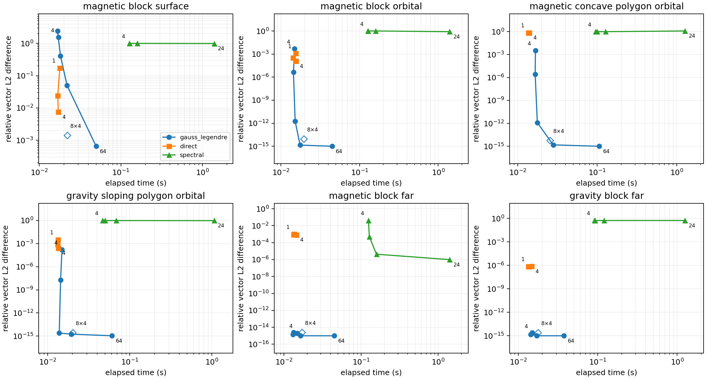

# Gauss–Legendre, direct and pure spectral comparison

Residuals are vector L2 differences divided by the reference vector L2 norm over identical observation grids. The reference is higher-order composite Gauss–Legendre integration, checked against a second resolution; it is a numerical reference, not an exact solution. Independent kernel, geometry and unit checks live in `tests/test_gauss_legendre.py`.

Pure spectral runs set `auto_mode=0`, `edge_correction=0`, `hybrid_mode=0` and `reg_lambda=0`. Their source mesh uses horizontal refine factor 4 and 12 radial samples. Direct runs retain card radial count 4. Each timing is one warmed-build Python call including subprocess startup and file I/O; it is not a repeated benchmark.

The cases span magnetic surface/orbital/far fields, a concave magnetic polygon and gravity. Low harmonic degrees cannot resolve the narrow near-surface sources. The current spectral basis starts at degree 1, so the gravity comparison also exposes the missing degree-0 monopole; increasing degree alone cannot recover it. The direct magnetic concave case retains a large discrepancy under refinement. Its side-wall normals are oriented using one interior point, which is unreliable for this notched footprint. The quadrature geometry is independently checked against a sum of nonoverlapping rectangles in the tests.

Compiler: GNU Fortran (Homebrew GCC 15.2.0_1) 15.2.0. Platform: macOS-26.6.2-arm64-arm-64bit-Mach-O.

## Reference convergence

| Case | Unit | Peak magnitude | Reference change | Converged |
|---|---|---:|---:|---|
| magnetic_block_surface | nt | 1109.56 | 3.337e-14 | True |
| magnetic_block_orbital | nt | 117.27 | 1.039e-15 | True |
| magnetic_concave_polygon_orbital | nt | 88.8105 | 5.702e-16 | True |
| gravity_sloping_polygon_orbital | mgal | 15.2554 | 8.935e-16 | True |
| magnetic_block_far | nt | 0.000103364 | 6.335e-16 | True |
| gravity_block_far | mgal | 0.00232062 | 6.253e-16 | True |

## Resolution sweeps

| Case | Solver | Setting | Relative L2 | Vector RMSE | Time (s) |
|---|---|---|---:|---:|---:|
| magnetic_block_surface | gauss_legendre | order_4 | 1.544e+00 | 8.060e+02 | 0.0172 |
| magnetic_block_surface | gauss_legendre | order_8 | 2.426e+00 | 1.267e+03 | 0.0167 |
| magnetic_block_surface | gauss_legendre | order_16 | 4.106e-01 | 2.144e+02 | 0.0182 |
| magnetic_block_surface | gauss_legendre | order_32 | 4.996e-02 | 2.609e+01 | 0.0219 |
| magnetic_block_surface | gauss_legendre | order_64 | 6.499e-04 | 3.394e-01 | 0.0498 |
| magnetic_block_surface | gauss_legendre | order_8_panels_4 | 1.406e-03 | 7.343e-01 | 0.0220 |
| magnetic_block_surface | direct | refine_1 | 1.742e-01 | 9.096e+01 | 0.0179 |
| magnetic_block_surface | direct | refine_2 | 2.388e-02 | 1.247e+01 | 0.0168 |
| magnetic_block_surface | direct | refine_4 | 7.489e-03 | 3.911e+00 | 0.0171 |
| magnetic_block_surface | spectral | degree_4 | 1.000e+00 | 5.223e+02 | 0.1276 |
| magnetic_block_surface | spectral | degree_8 | 1.000e+00 | 5.223e+02 | 0.1275 |
| magnetic_block_surface | spectral | degree_12 | 1.000e+00 | 5.223e+02 | 0.1588 |
| magnetic_block_surface | spectral | degree_24 | 9.940e-01 | 5.191e+02 | 1.3889 |
| magnetic_block_orbital | gauss_legendre | order_4 | 4.924e-03 | 3.429e-01 | 0.0149 |
| magnetic_block_orbital | gauss_legendre | order_8 | 4.465e-06 | 3.110e-04 | 0.0144 |
| magnetic_block_orbital | gauss_legendre | order_16 | 1.763e-12 | 1.228e-10 | 0.0152 |
| magnetic_block_orbital | gauss_legendre | order_32 | 1.445e-15 | 1.007e-13 | 0.0175 |
| magnetic_block_orbital | gauss_legendre | order_64 | 8.236e-16 | 5.736e-14 | 0.0447 |
| magnetic_block_orbital | gauss_legendre | order_8_panels_4 | 8.595e-15 | 5.987e-13 | 0.0196 |
| magnetic_block_orbital | direct | refine_1 | 1.233e-03 | 8.586e-02 | 0.0154 |
| magnetic_block_orbital | direct | refine_2 | 3.153e-04 | 2.196e-02 | 0.0142 |
| magnetic_block_orbital | direct | refine_4 | 1.186e-04 | 8.260e-03 | 0.0155 |
| magnetic_block_orbital | spectral | degree_4 | 1.001e+00 | 6.975e+01 | 0.1271 |
| magnetic_block_orbital | spectral | degree_8 | 1.004e+00 | 6.991e+01 | 0.1288 |
| magnetic_block_orbital | spectral | degree_12 | 1.002e+00 | 6.982e+01 | 0.1597 |
| magnetic_block_orbital | spectral | degree_24 | 8.097e-01 | 5.640e+01 | 1.3956 |
| magnetic_concave_polygon_orbital | gauss_legendre | order_4 | 3.383e-03 | 1.711e-01 | 0.0167 |
| magnetic_concave_polygon_orbital | gauss_legendre | order_8 | 2.734e-06 | 1.383e-04 | 0.0166 |
| magnetic_concave_polygon_orbital | gauss_legendre | order_16 | 1.247e-12 | 6.307e-11 | 0.0177 |
| magnetic_concave_polygon_orbital | gauss_legendre | order_32 | 1.531e-15 | 7.746e-14 | 0.0280 |
| magnetic_concave_polygon_orbital | gauss_legendre | order_64 | 7.480e-16 | 3.784e-14 | 0.1058 |
| magnetic_concave_polygon_orbital | gauss_legendre | order_8_panels_4 | 5.510e-15 | 2.787e-13 | 0.0256 |
| magnetic_concave_polygon_orbital | direct | refine_1 | 7.411e-01 | 3.748e+01 | 0.0138 |
| magnetic_concave_polygon_orbital | direct | refine_2 | 7.405e-01 | 3.745e+01 | 0.0136 |
| magnetic_concave_polygon_orbital | direct | refine_4 | 7.403e-01 | 3.745e+01 | 0.0140 |
| magnetic_concave_polygon_orbital | spectral | degree_4 | 1.001e+00 | 5.066e+01 | 0.0956 |
| magnetic_concave_polygon_orbital | spectral | degree_8 | 1.004e+00 | 5.079e+01 | 0.0996 |
| magnetic_concave_polygon_orbital | spectral | degree_12 | 1.003e+00 | 5.071e+01 | 0.1271 |
| magnetic_concave_polygon_orbital | spectral | degree_24 | 1.229e+00 | 6.215e+01 | 1.2679 |
| gravity_sloping_polygon_orbital | gauss_legendre | order_4 | 1.618e-04 | 1.499e-03 | 0.0149 |
| gravity_sloping_polygon_orbital | gauss_legendre | order_8 | 1.816e-08 | 1.683e-07 | 0.0143 |
| gravity_sloping_polygon_orbital | gauss_legendre | order_16 | 2.486e-15 | 2.304e-14 | 0.0138 |
| gravity_sloping_polygon_orbital | gauss_legendre | order_32 | 1.804e-15 | 1.672e-14 | 0.0193 |
| gravity_sloping_polygon_orbital | gauss_legendre | order_64 | 1.095e-15 | 1.015e-14 | 0.0607 |
| gravity_sloping_polygon_orbital | gauss_legendre | order_8_panels_4 | 2.808e-15 | 2.603e-14 | 0.0201 |
| gravity_sloping_polygon_orbital | direct | refine_1 | 3.237e-03 | 3.000e-02 | 0.0133 |
| gravity_sloping_polygon_orbital | direct | refine_2 | 8.207e-04 | 7.606e-03 | 0.0131 |
| gravity_sloping_polygon_orbital | direct | refine_4 | 2.629e-04 | 2.436e-03 | 0.0134 |
| gravity_sloping_polygon_orbital | spectral | degree_4 | 9.935e-01 | 9.208e+00 | 0.0465 |
| gravity_sloping_polygon_orbital | spectral | degree_8 | 9.806e-01 | 9.089e+00 | 0.0498 |
| gravity_sloping_polygon_orbital | spectral | degree_12 | 9.667e-01 | 8.960e+00 | 0.0683 |
| gravity_sloping_polygon_orbital | spectral | degree_24 | 9.534e-01 | 8.837e+00 | 1.0635 |
| magnetic_block_far | gauss_legendre | order_4 | 2.024e-15 | 2.046e-19 | 0.0148 |
| magnetic_block_far | gauss_legendre | order_8 | 2.445e-15 | 2.472e-19 | 0.0133 |
| magnetic_block_far | gauss_legendre | order_16 | 1.408e-15 | 1.424e-19 | 0.0131 |
| magnetic_block_far | gauss_legendre | order_32 | 4.566e-17 | 4.617e-21 | 0.0164 |
| magnetic_block_far | gauss_legendre | order_64 | 6.903e-16 | 6.980e-20 | 0.0449 |
| magnetic_block_far | gauss_legendre | order_8_panels_4 | 2.516e-15 | 2.544e-19 | 0.0171 |
| magnetic_block_far | direct | refine_1 | 1.019e-03 | 1.031e-07 | 0.0135 |
| magnetic_block_far | direct | refine_2 | 8.847e-04 | 8.947e-08 | 0.0133 |
| magnetic_block_far | direct | refine_4 | 8.231e-04 | 8.323e-08 | 0.0144 |
| magnetic_block_far | spectral | degree_4 | 4.137e-02 | 4.184e-06 | 0.1245 |
| magnetic_block_far | spectral | degree_8 | 5.076e-04 | 5.133e-08 | 0.1279 |
| magnetic_block_far | spectral | degree_12 | 4.312e-06 | 4.361e-10 | 0.1581 |
| magnetic_block_far | spectral | degree_24 | 9.844e-07 | 9.955e-11 | 1.4051 |
| gravity_block_far | gauss_legendre | order_4 | 2.079e-15 | 4.823e-18 | 0.0149 |
| gravity_block_far | gauss_legendre | order_8 | 2.459e-15 | 5.705e-18 | 0.0150 |
| gravity_block_far | gauss_legendre | order_16 | 1.407e-15 | 3.264e-18 | 0.0144 |
| gravity_block_far | gauss_legendre | order_32 | 8.292e-17 | 1.924e-19 | 0.0171 |
| gravity_block_far | gauss_legendre | order_64 | 6.953e-16 | 1.613e-18 | 0.0375 |
| gravity_block_far | gauss_legendre | order_8_panels_4 | 2.518e-15 | 5.841e-18 | 0.0177 |
| gravity_block_far | direct | refine_1 | 7.437e-07 | 1.725e-09 | 0.0136 |
| gravity_block_far | direct | refine_2 | 7.042e-07 | 1.634e-09 | 0.0134 |
| gravity_block_far | direct | refine_4 | 7.656e-07 | 1.776e-09 | 0.0146 |
| gravity_block_far | spectral | degree_4 | 5.573e-01 | 1.293e-03 | 0.0907 |
| gravity_block_far | spectral | degree_8 | 5.521e-01 | 1.281e-03 | 0.0925 |
| gravity_block_far | spectral | degree_12 | 5.523e-01 | 1.281e-03 | 0.1201 |
| gravity_block_far | spectral | degree_24 | 5.523e-01 | 1.281e-03 | 1.2526 |

Exact models, options, per-component RMSE and solver diagnostics are saved in `results.json`; summed XYZ fields are saved in `fields.npz`. Residual units follow each case. `results.csv` provides the compact sweep table. Plot labels show the first and final node orders, direct refine factors or spectral degrees. The separate diamond labelled 8×4 uses order 8 with four panels in each dimension.
